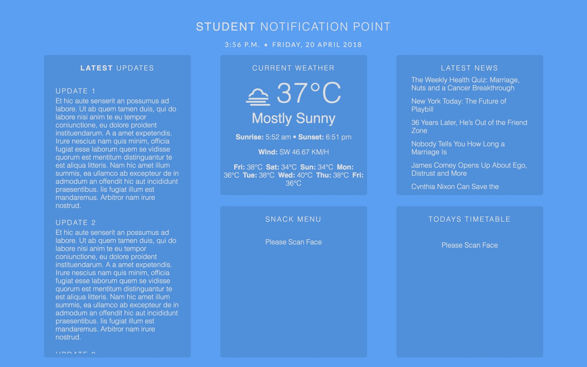

# E-Billboard

### Face Recognizing Smart Notification Board

Demo video: https://youtu.be/MsXc8tdRfdY

The E-Billboard is a smart & dynamic information display system. It can recognize a bystander's face and show them relevant information like their lunch menu, timetable, and more. Face recognition is done using Haar feature-based cascade classifiers via OpenCV. Ideally, the whole system is meant to run on a Raspberry Pi (easy TV output) equipped with a camera module. The system can also run on a server connected to a camera and relay this data to a Raspberry Pi forming a distributed network.

## Features

The E-billboard displays useful information like:
* Current weather
* Latest news
* Users/Students's timetable
* Dynamic food menu (for example, the lunch menu is displayed between 12:00 PM - 2:30 PM and the dinner menu is displayed after that till 9:30 PM)
* Latest updates (news related to the student's institution)

## Screenshot

## Built with

* HTML
* CSS
* Javascript
* PHP
* MySQL
* Tkinter
* Python
* OpenCV
